# Documentation of relay board py

1. [Introduction](#introduction)
2. [Features](#features)
3. [Specification](#specification)
    * [Definitions](#definitions)
    * [Characteristics](#characteristics)
4. [Package installation](#package-installation)
5. [Package usage](#package-usage)
    * [Execute package as module](#execute-package-as-module)
        * [Arguments](#arguments)
        * [Pattern files](#pattern-files)
    * [Integrate package in own module](#integrate-package-in-own-module)
6. [Use-cases](#use-cases)
    * [Switch programmer](#switch-programmer)
    * [Switch target](#switch-target)
    * [Cascaded relay boards](#cascaded-relay-boards)
    * [Adapters](#adapters)
        * [Adapter Generic](#adapter-generic)
        * [Adapter TC2050-430](#adapter-tc2050-430)
        * [Adapter J-Link](#adapter-j-link)
        * [Adapter ST-Link](#adapter-st-link)

<a id="introduction"></a>
## Introduction

This documentation gives an overview of the components,
functionality and usage of relay board **RB-1-10**.

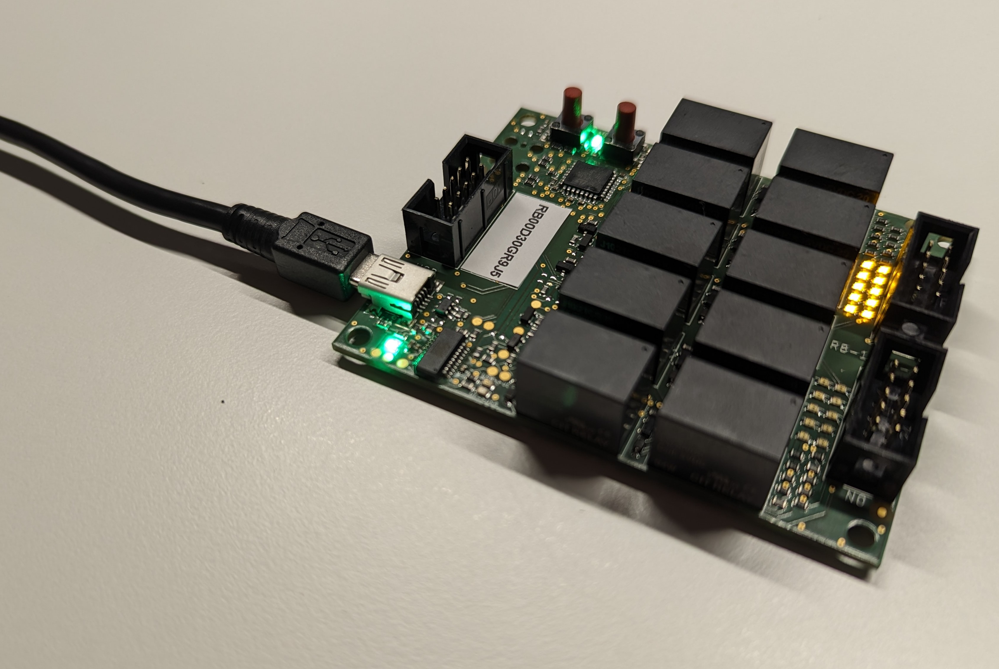

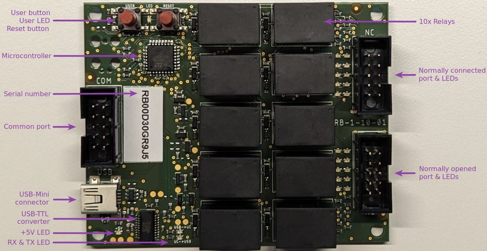

<a id="features"></a>
## Features

- **Generic** pin switcher for development, testing, CI/CD, production, measurement etc.
- **Galvanic isolation** between multiple devices
(e.g. to physically disconnect a programmer after programming a target)
- **Individual** control of all relay states
- **LEDs** indicating the current relay state of each relay
- **Cascading** of relay boards possible (to connect more devices)
- Reset button reboots the microcontroller
- User button toggles all relay states by default
- Python package to control relay board(s) from a host PC
- Unique **serial number** to identify each relay board

<a id="specification"></a>
## Specification

<a id="definitions"></a>
### Definitions

| Name          |  Description                                                               |
| :------------ | :------------------------------------------------------------------------- |
| Serial number | **RB** **XX** **YYYYYYYY** (**X**: board-config, **Y**: USB serial number) |
| COM           | The common port of a relay                                                 |
| NC            | The normally connected port of a relay (connected if relay is open)        |
| NO            | The normally opened port of a relay (connected if relay is closed)         |
| Target        | The device to be programmed, analyzed, debugged, ...                       |

<a id="characteristics"></a>
### Characteristics

Characteristiscs of **RB-1-10**:

| Property                                         | Value  |
| :----------------------------------------------- | :----- |
| Number of individually switchable pins COM/NO/NC | 10     |
| Maximum voltage per pin                          | 60 V   |
| Maximum current per pin                          | 2 A    |
| Relay board supply voltage (USB)                 | 5 V    |
| Relay board supply current (all relays opened)   | 20 mA  |
| Relay board supply current (all relays closed)   | 350 mA |

Pinout of **RB-1-10**:


<a id="package-installation"></a>
## Package installation

Install the `relay_board_py` package via `pip`:
```bash
python3 -m pip install relay_board_py
```

Alternatively, the package can also be installed within a `pipenv` virtual environment:
```bash
pipenv install relay_board_py
```

<a id="package-usage"></a>
## Package usage

<a id="execute-package-as-module"></a>
### Execute package as module

```bash
# with python:
python3 -m relay_board_py -s RB00D30GR9J5 -c 1,7 -o 2 -r
# within pipenv virtual environment:
pipenv run python3 -m relay_board_py -s RB00D30GR9J5 -c 1,7 -o 2 -r
```

<a id="arguments"></a>
#### Arguments

```bash
-h, --help          show this help message and exit
-s SERIAL_NUMBER    Serial-number in single operation mode
-o OPEN             Relay ids to be opened "-o 1,2,3" or "-o all"
-c CLOSE            Relay ids to be closed "-c 1,2,3" or "-c all"
-f FILE             File path to json file containing the patterns
-p PATTERN          Pattern to be used in provided json file
-r                  Reset relay-board(s) first, before executing the operations
-i                  Print info about relay-board(s)
```

Relay boards can be controlled:
- by serial-number (arguments: -s, -o, -c)
- by json pattern file (arguments: -f, -p)

<a id="pattern-files"></a>
#### Pattern files

For more complex relay board control, json "pattern" files can be defined:
```json
{
    "aliases": {
        "A1": "RB00D30GR9J2",
        "A2": "RB00D30GR9J5"
    },
    "patterns": {
        "P1": {
            "A1": {
                "open": [1],
                "close": [2]
            },
            "A2": {
                "open": [3],
                "close": [4]
            }
        },
        "P2": {
            "A1": {
                "close": "all"
            }
        }
    }
}
```

**aliases**:
Creates an alias name for each relay board serial number to be used.
The alias can be **any** string.

**patterns**:
Creates one or multiple patterns. The pattern name can be **any** string.
Inside a pattern, all relay board aliases to be used for **this** pattern must be added.
Finally, the state (`close`, `open`) for each alias must be defined.
It can be either a list of relay ids (integer) or `"all"` (string).
The execution order of the aliases and states corresponds to the definition in the pattern.

The pattern file can be executed:
```bash
python -m relay_board_py -f example_pattern.json -p P2 -r
```

<a id="integrate-package-in-own-module"></a>
### Integrate package in own module

1. By calling `staticmethod` `main` of `RelayBoard` class with command line arguments:
```python
from relay_board_py.relay_board import RelayBoard

RelayBoard.main(['-s', 'RB00D30GR9J5', '-c', '1,7', '-o', '2', '-r'])
```

2. By creating `RelayBoard` object:
```python
from relay_board_py.relay_board import RelayBoard
import time

relay_board = RelayBoard("RB00D30GR9J5")
relay_board.open()
relay_board.print_info()  # optional
relay_board.reset()  # optional
relay_board.write_relay_state({"close": [1, 7], "open": [2]})
time.sleep(1)
relay_board.write_relay_state({"open": "all"})
time.sleep(1)
relay_board.write_relay_state({"close": "all"})
relay_board.close()
```

<a id="use-cases"></a>
## Use-cases

There are various use-cases for relay-board(s):
- Disconnect a programmer after programming to **not disturb** the target
(low-power states, power-consumption, etc.)
- Switch a single (potentially expensive) programmer between multiple target to **save costs**
- ...

<a id="switch-programmer"></a>
### Switch programmer

A single programmer (e.g. a J-Link) can be switched between multiple targets.


After power up, all relays are switched from **COM**-port to **NC**-port (NC = normally connected):


All relays can be switched from **COM**-port to **NO**-port (NO = normally opened):


Additionally, **each** relay/pin can be switched **individually**:


<a id="switch-target"></a>
### Switch target

The pins of a target can be switched between multiple devices (programmer, power supply, etc.).

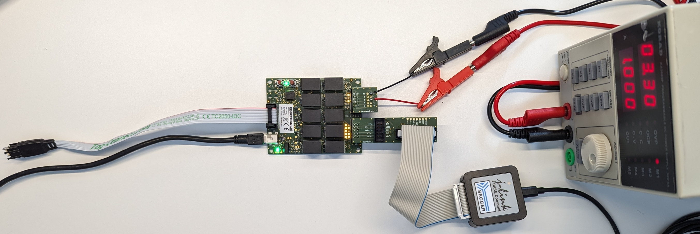

All connected pins of a target can be swtiched individually to fulfill different purposes:


<a id="cascaded-relay-boards"></a>
### Cascaded relay boards

Relay boards can also be cascaded:

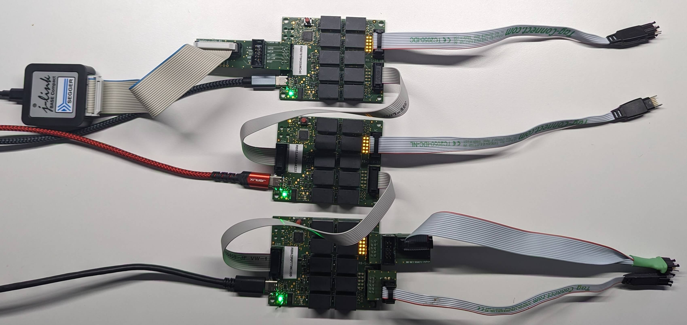

<a id="adapters"></a>
### Adapters

Multiple adapters are available to enable comfortable connection to the relay board.

<a id="adapter-generic"></a>
#### Adapter Generic

This is a generic 10 pins (1-10) adapter to create create custom adapters.
The additional 20 pins (A-T) are not connected to the 10 pins (1-10), so they can be used
for soldering different connectors/headers with a custom pinout.

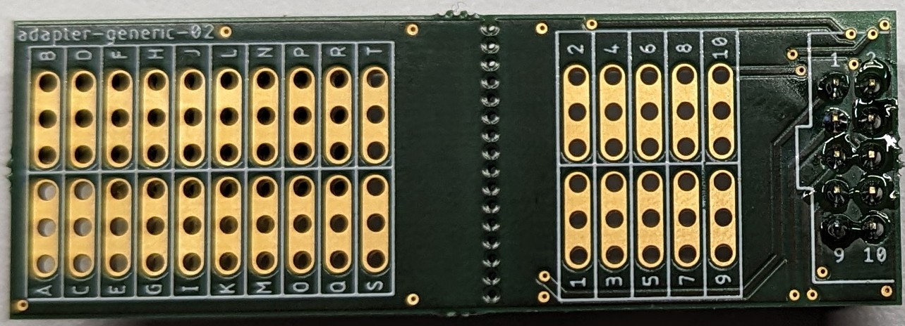 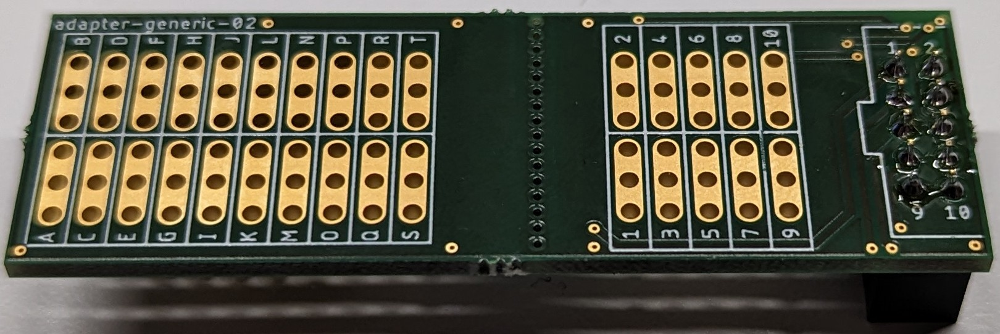

<a id="adapter-tc2050-430"></a>
#### Adapter TC2050-430

This is an adapter between [TC2050-IDC-430](https://www.tag-connect.com/product/tc2050-idc-430-legged-cable-for-use-with-msp430-fet430)
(14 pins) to [TC2050-IDC](https://www.tag-connect.com/product/tc2050-idc-tag-connect-2050-idc) (10 pins).

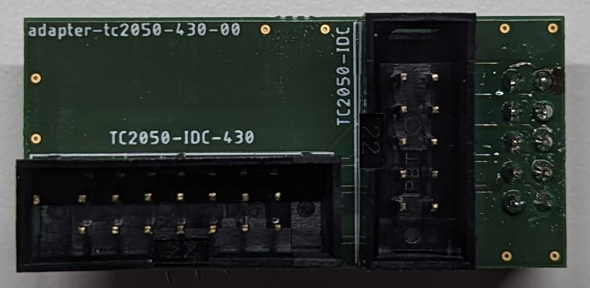 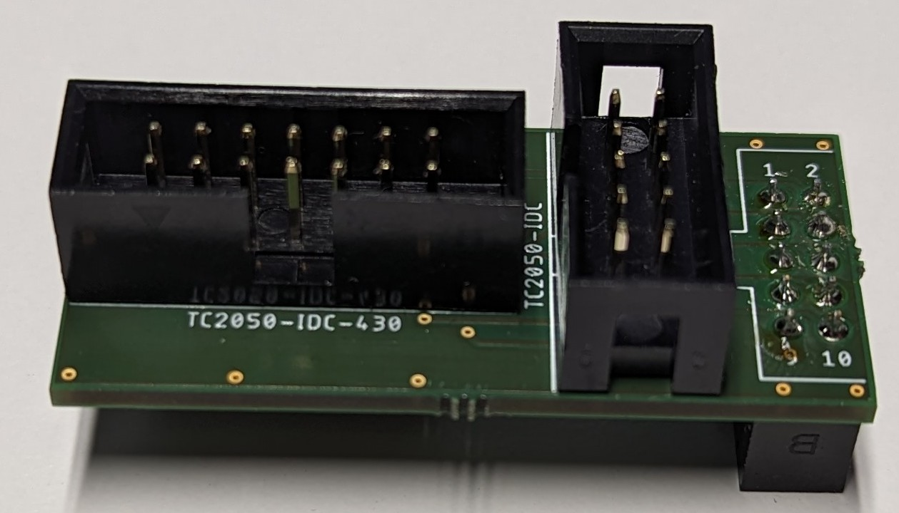


<a id="adapter-j-link"></a>
#### Adapter J-Link

This is an adapter between J-Link (20 pins) to 10 pins (e.g. for TC2050-IDC).

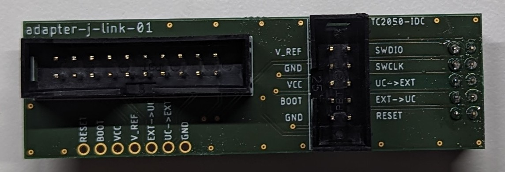 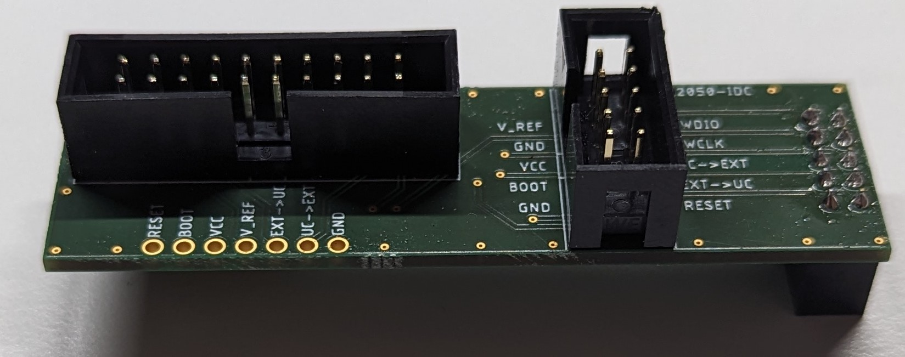


<a id="adapter-st-link"></a>
#### Adapter ST-Link

This is an adapter between ST-Link (20 pins) to 10 pins (e.g. for TC2050-IDC).

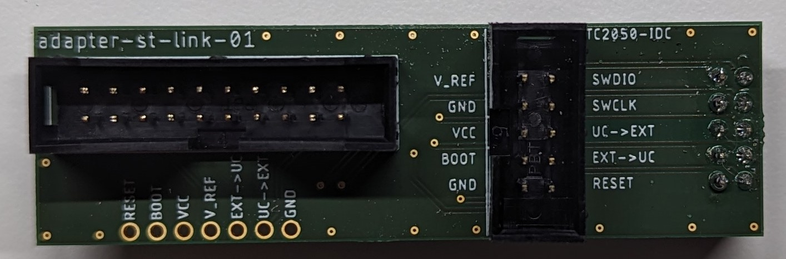 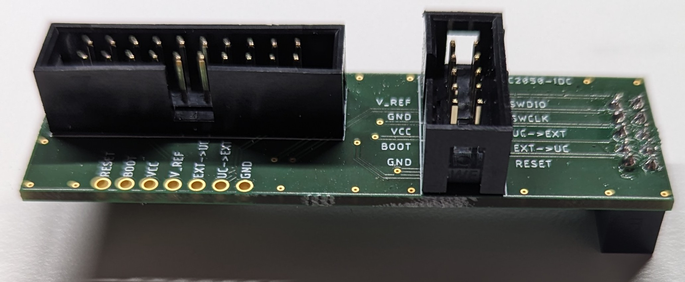


