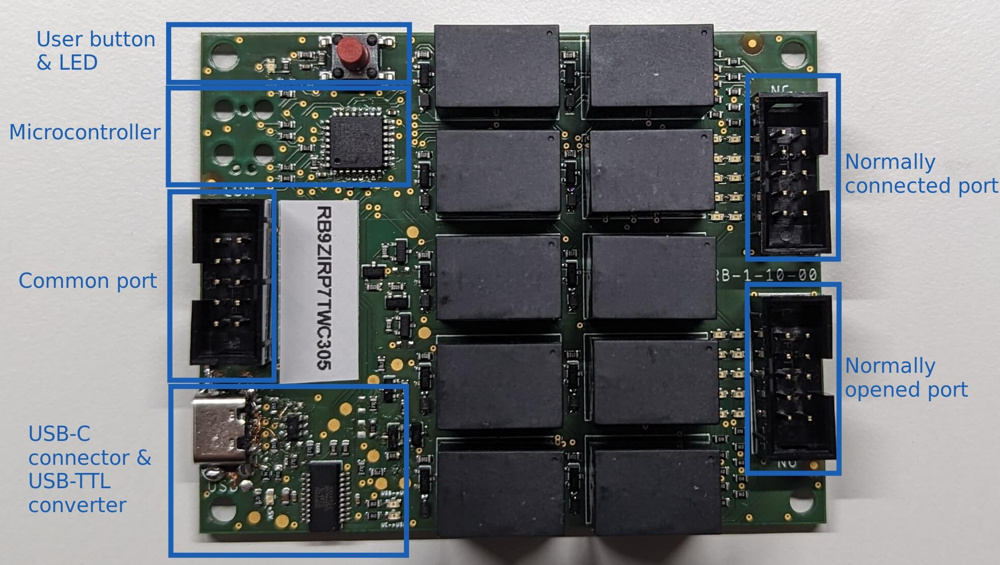
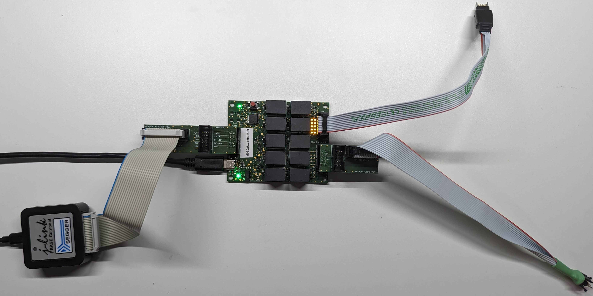
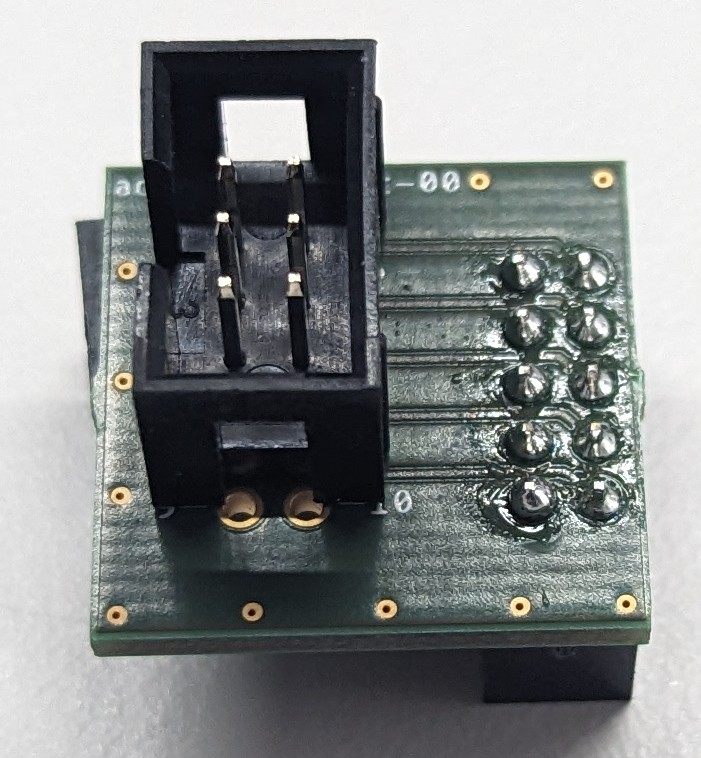

# Documentation of relay board py
This is the actual documentation of the package and the relay board.

1. [Introduction](#introduction)
2. [Specification](#specification)
    * [Naming](#naming)
    * [Characteristics](#characteristics)
2. [Package installation](#package-installation)
3. [Package usage](#package-usage)
    * [Arguments](#arguments)
    * [Pattern-files](#pattern-files)
4. [Use-cases](#use-cases)
    * [Switch programmer](#switch-programmer)
    * [Switch target](#switch-target)
    * [Adapters](#adapters)
        * [Adapter TC2050-430](#adapter-tc2050-430)
        * [Adapter J-Link](#adapter-j-link)
        * [Adapter ST-Link](#adapter-st-link)
        * [Adapter Generic](#adapter-generic)

<a id="introduction"></a>
## Introduction





- **Generic** pin switcher for development, production, testing, measurements etc.
- **Galvanic isolation** between multiple devices
- **Individual** control of all relay states
- **Cascading** of relay boards possible (to connect more devices)
- Python package to control relay board(s) from a host PC
- Unique serial number to identify each relay board
- LEDs indicating the current relay state of each relay

<a id="specification"></a>
## Specification

<a id="naming"></a>
### Naming

| Name   |  Description                                                        |
| :---   | :------------------------------------------------------------------ |
| COM    | The common port of a relay                                          |
| NC     | The normally connected port of a relay (connected if relay is open) |
| NO     | The normally opened port of a relay (connected if relay is closed)  |
| Target | The device to be programmed, analyzed, debugged, ...                |

<a id="characteristics"></a>
### Characteristics

Characteristiscs of **RB-1-10**:

| Property                                         | Value |
| :----------------------------------------------- | :---- |
| Number of individually switchable pins COM/NO/NC | 10    |
| Maximum voltage per pin                          | 60 V  |
| Maximum current per pin                          | 2 A   |

<a id="package-installation"></a>
## Package installation

Install the `relay_board_py` package via `pip`:
```bash
python3 -m pip install relay_board_py
```

<a id="package-usage"></a>
## Package usage

1. Execute package directly as module:
```bash
python3 -m relay_board_py -s RB90FJ7SIHYU1F -c 1,7 -o 2 -r
```

2. Integrate into own python module:
```python
from relay_board_py.relay_board import RelayBoard

RelayBoard.main(['-s', 'RB90FJ7SIHYU1F', '-c', '1,7', '-o', '2', '-r'])
```

<a id="arguments"></a>
### Arguments

```bash
    -h, --help          show this help message and exit
    -s SERIAL_NUMBER    Serial-number in single operation mode
    -o OPEN             Specify relay ids to be opened "-o 1,2,3"
    -c CLOSE            Specify relay ids to be closed "-c 1,2,3"
    -f FILE             File path to json file containing the patterns
    -p PATTERN          Pattern to be used in provided json file
    -r                  Reset relay-board(s) first, before executing the operations
    -i                  Print info about relay-board(s)
```

Relay boards can be controlled:
- by serial-number (arguments: -s, -o, -c)
- by json pattern file (arguments: -f, -p)

<a id="pattern-files"></a>
### Pattern files

For more complex relay board control, json "pattern" files can be defined:
```json
{
    "aliases": {
        "A1": "RB90FJ7SIHYU1F",
        "A2": "RB9ZIRP7TWC305"
    },
    "patterns": {
        "P1": {
            "A1": {
                "open": [1],
                "close": [2]
            },
            "A2": {
                "open": [3],
                "close": [4]
            }
        },
        "P2": {
            "A1": {
                "open": [10],
                "close": [1, 2]
            }
        }
    }
}
```

**aliases**:
Creates an alias name for each relay board serial number to be used.
The alias can be **any** string.

**patterns**:
Creates one or multiple patterns. The pattern name can be **any** string.
Inside a pattern, all relay board aliases to be used for **this** pattern must be added.
Finally, the state (close, open) for each alias must be defined as a list of relay ids (integer).

The pattern file can be executed:
```bash
python -m relay_board_py -f example_pattern.json -p P2 -r
```

<a id="use-cases"></a>
## Use-cases

There are various use-cases for relay-board(s):
- Disconnect a programmer after programming to not disturb the device
(low-power states, power-consumption, etc.)
- Switch a (potentially expensive) programmer between multiple devices to save costs
- ...

<a id="switch-programmer"></a>
### Switch programmer

A single programmer (e.g. a J-Link) can be switched between multiple targets.

After power up, all relays are switched from **COM**-port to **NC**-port (NC = normally connected):


All relays can be switched from **COM**-port to **NO**-port (NO = normally opened):


Additionally, **each** relay/pin can be switched **individually**:


<a id="switch-target"></a>
### Switch target

The pins of a target can be switched between multiple devices (programmer, power supply, etc.).

All connected pins of a target can be swtiched individually to fulfill different purposes:


<a id="adapters"></a>
### Adapters

Multiple adapters are available to enable comfortable connection to the relay board.

<a id="adapter-tc2050-430"></a>
#### Adapter TC2050-430

This is a generic adapter between [TC2050-IDC-430](https://www.tag-connect.com/product/tc2050-idc-430-legged-cable-for-use-with-msp430-fet430)
(14 pins) to [TC2050-IDC](https://www.tag-connect.com/product/tc2050-idc-tag-connect-2050-idc) (10 pins).

 

<a id="adapter-j-link"></a>
#### Adapter J-Link

This is an adapter between J-Link (20 pins) to 10 pins (e.g. for TC2050-IDC).

 

<a id="adapter-st-link"></a>
#### Adapter ST-Link

This is an adapter between ST-Link (20 pins) to 10 pins (e.g. for TC2050-IDC).

 

<a id="adapter-generic"></a>
#### Adapter Generic

This is a generic 10 pins adapter. Can be used for custom adapters (e.g. just use 6 pins).

 

